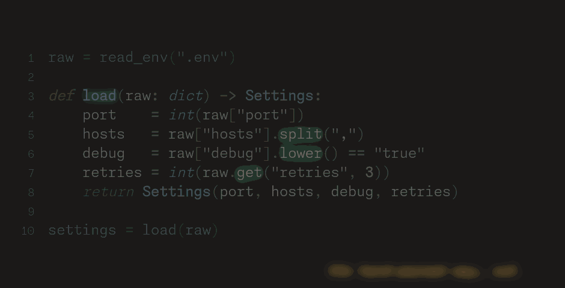
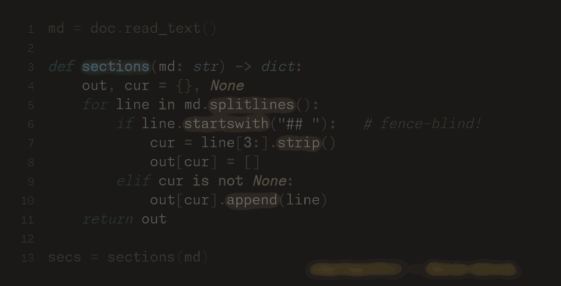

# myBasis: _Ergonomic Python Utilities_

  [](/LICENSE)

[](https://pypi.org/project/my-basis)  [](https://pypi.org/project/my-basis) [](https://pypi.org/project/my-basis)

<!-- Not live yet -- restore once ReadTheDocs is provisioned:
[](https://my-basis.readthedocs.io)
-->

[](https://github.com/pre-commit/pre-commit) [](https://github.com/facebook/pyrefly) [](https://github.com/astral-sh/ruff)

The myBasis package — imported, immodestly, as `my` — is a broad extension of the Python standard library centered on text processing, functional programming, and runtime type coercion.
It is released, typed, tested, and in daily use as the shared foundation of every other project in its author's ecosystem; it is also young, so while the APIs below are stable in spirit, pre-1.0 minor versions may still move them (pin accordingly).

Its breadth is somewhat unusual: any given application will probably use a small subset of the contents, so it shines where dependency purity isn't paramount — personal projects, local dev scripts, offline data processing, prototypes.
As a rough sense of scale: a bare `pip install my-basis` pulls a couple dozen distributions (on the order of ~80 MB unpacked), and turning on every optional extra can push a full environment past ~290 MB.

______________________________________________________________________

## See it in action

Two everyday chores, rewritten in front of you.
Each clip is real `my` code: the fragile, hand-rolled version on the left collapses into the one-liner on the right.

### One cast. Every field.



`ty.cast` reads the _target_ type and coerces every field to match — `int`, `tuple`, `bool`, nested models and all.
A whole page of `int(...)` / `.split(",")` / `.lower() == "true"` hand-parsing becomes a single, honest line.

### A document, not a string.



`Markdown.parse` turns a document into a real, fence-aware tree you can `.walk()` to any depth.
So pulling the sections out of a file stops being a `startswith("## ")` slicing exercise that silently breaks the moment a `##` appears inside a code fence.

______________________________________________________________________

## What's inside

Roughly ninety exports across seven subpackages, every one of them surfaced at the single `import my` root.
This table is the map; each link lands on the corresponding page of the rendered docs (`task docs` builds them locally — see [Documentation](#documentation)).

| Area                                                                             | Exports                                                                                                                                                                                                                                                                                                                                                                                                                                                                                                                                                                                                                                                                                                                                                                                                                                                                                                                                             |
| -------------------------------------------------------------------------------- | --------------------------------------------------------------------------------------------------------------------------------------------------------------------------------------------------------------------------------------------------------------------------------------------------------------------------------------------------------------------------------------------------------------------------------------------------------------------------------------------------------------------------------------------------------------------------------------------------------------------------------------------------------------------------------------------------------------------------------------------------------------------------------------------------------------------------------------------------------------------------------------------------------------------------------------------------- |
| **Iteration** <br> [`my.utils`](docs/utils.md)                                   | [`IterUtils`](docs/utils.IterUtils.md) — `partition` · `multi_partition` · `type_partition` · `bucket` · `find` · `find_key` · `next_in` · `condense` · `map_condense` · `get_all` · `get_any` · `get_first` · `val_map` · `attr_map` · `inverse_map` · `apply` · `safe` · `normalize` · `indexof` · `has_all` / `has_any` / `has_only` / `has_none` · `all_has_all` … `any_has_any` · `predicate` · `normalize_predicate` · `shared_prefix` · `shared_suffix` · `common_elements` · `exclusive_elements` · `drop_at` · `drop_duplicates` · `repeat_until_complete` · `build` · `map_items`                                                                                                                                                                                                                                                                                                                                                         |
| **Text** <br> [`my.utils`](docs/utils.md), [`my.types`](docs/types.md)           | [`TextUtils`](docs/utils.TextUtils.md) — `replace` · `split_into` · `regex_dict` · `regex_array` · `multi_rgx` · `strip_quotes` · `clean_string` · `wrap` · `to_words` · `line_num` · `parse_domain` · `indent` / `unindent` · `wrap_paragraphs` / `unwrap_paragraphs` <br> [`Buffer`](docs/types.Buffer.md) — a mutable text container for iterative string surgery                                                                                                                                                                                                                                                                                                                                                                                                                                                                                                                                                                                |
| **Syntax & semantics** <br> [`my.utils`](docs/utils.md)                          | [`SyntaxUtils`](docs/utils.SyntaxUtils.md) — `fill_tree` · `tree_size` · `pyd_schemify` · `instance_fields` · `instance_aliases` · `nested_replace` · `import_module` · `clear_cached_properties` <br> [`SemanticUtils`](docs/utils.SemanticUtils.md) — `decimal_to_roman` / `roman_to_decimal` · `format_amount` · `to_singular` · `to_ordinal` · `validate_identifier`                                                                                                                                                                                                                                                                                                                                                                                                                                                                                                                                                                            |
| **System & shell** <br> [`my.utils`](docs/utils.md), [`my.types`](docs/types.md) | [`SystemUtils`](docs/utils.SystemUtils.md) — `posix` · `posix_since` · `validate_dir` / `validate_file` · `path` · `path_sub` · `is_pathy` · `from_file` / `to_file` (+ `json` / `yaml` / `toml` / `pickle` variants) · `serialize` · `log` / `info` / `warn` / `error` · `multiprint` · `debug_fence` · `is_installed` · `mock_if_uninstalled` · `get_terminal_width` · `terminal_linewrap` · `zsh_colorize` · `print_in_color` · `confirm` / `auto_confirm` <br> [`Command`](docs/types.Command.md) — durable shell invocations, sync or async <br> [`Platform`](docs/types.Platform.md) — a small enum of supported OSes                                                                                                                                                                                                                                                                                                                         |
| **Observability** <br> [`my.utils`](docs/utils.md)                               | [`MetricUtils`](docs/utils.MetricUtils.md) (`[metrics]` extra) — `setup_logging` · `setup_fire_logging` · `setup_metrics` · `setup_warnings` · `measure_context` · `monitor`                                                                                                                                                                                                                                                                                                                                                                                                                                                                                                                                                                                                                                                                                                                                                                        |
| **Vibe typing** <br> [`my.typing`](docs/typing.md)                               | [`ty` / `Typist`](docs/typing.Typist.md) — the `cast` / `check` / `match` singleton <br> [`MyType`](docs/typing.MyType.md) — any annotation, parsed into one introspectable node <br> [`AutocastModel`](docs/typing.AutocastModel.md) — a Pydantic base that casts on validation <br> [`TypeCast`/`tyt`](docs/typing.cast.md) · [`TypeCheck`/`tyc`](docs/typing.check.md) · [`TypeMatch`/`tym`](docs/typing.match.md) · [`CastFlags`](docs/typing.cast.md) · `TypeArg`                                                                                                                                                                                                                                                                                                                                                                                                                                                                              |
| **Type vocabulary** <br> `my.infra`                                              | Union aliases with matching `isinstance` tuples: `Atom`/`Atoms` · `Scalar`/`Scalars` · `Real`/`Reals` · `String`/`Strings` · `Time`/`Times` · `Vec`/`Vecs` · `Map`/`Maps` · `Struct`/`Structs` · `Func`/`Funcs` · `Stream`/`Streams` · `Model` — plus the generic alias quartet `FuncT` / `MapT` / `VecT` / `StructT`                                                                                                                                                                                                                                                                                                                                                                                                                                                                                                                                                                                                                               |
| **Reusable types** <br> [`my.types`](docs/types.md)                              | [`MyEnum`](docs/types.MyEnum.md) — enums with forgiving parsing & arithmetic <br> [`Span`](docs/types.Span.md) — immutable half-open `[start, end)` intervals <br> [`UniqueId` / `Uid`](docs/types.UniqueId.md) — validated uuid4 wrappers <br> [`Predicate`](docs/types.Predicate.md) — string-set predicates for vibe-typed matching                                                                                                                                                                                                                                                                                                                                                                                                                                                                                                                                                                                                              |
| **Regex** <br> [`my.regex`](docs/regex.md)                                       | [`RegexStore`](docs/regex.RegexStore.md) — `define` · `compose` · `search` / `findall` / `finditer` / `fullmatch` · `fullsplit` · `polymatch` · `route_match` · `apply` · `filter` · `atom` · `pretty_print` <br> [`MatchData`](docs/regex.MatchData.md) — ergonomic match results, repeated groups included <br> [`RegexDebugger`](docs/regex.RegexDebugger.md) — find out _why_ a pattern fails <br> [`COMMON_RGXS`](docs/regex.common.md) — a battery of ready-made patterns (`url`, `md_url`, `tld`, …) <br> [meta layer](docs/regex.meta.md): [`Regex`](docs/regex.meta.Regex.md) · [`Tree`](docs/regex.meta.Tree.md) · [`RgxAtom`](docs/regex.meta.Atom.md) · [`GroupAtom`](docs/regex.meta.GroupAtom.md) · [`SetAtom`](docs/regex.meta.SetAtom.md) · [`GroupKind`](docs/regex.meta.GroupKind.md) · [`Quantifier`](docs/regex.meta.Quantifier.md) · [`ParseData`](docs/regex.meta.ParseData.md) · [`META_RGXS`](docs/regex.meta.meta_rgxs.md) |
| **Caches** <br> [`my.caches`](docs/caches.md)                                    | [`Cache`](docs/caches.Cache.md) — pruned LRU dict <br> [`NestedCache`](docs/caches.NestedCache.md) — hierarchical, self-pruning levels <br> [`FileCache`](docs/caches.FileCache.md) — two-level memory + disk <br> [`PickleCache`](docs/caches.PickleCache.md) — pickle-backed persistence with TTL                                                                                                                                                                                                                                                                                                                                                                                                                                                                                                                                                                                                                                                 |
| **Interfaces** <br> [`my.apis`](docs/apis.md)                                    | [`env` / `Environment`](docs/apis.Environment.md) — typed, ergonomic environment variables <br> [`fs` / `Filesystem` / `PATHS`](docs/apis.Filesystem.md) — a named registry of filesystem paths <br> [`GoogleSheet`](docs/apis.GoogleSheet.md) (`[google]` extra) — sheets in, `DataFrame`s out                                                                                                                                                                                                                                                                                                                                                                                                                                                                                                                                                                                                                                                     |
| **File formats** <br> [`my.files`](docs/files.md)                                | [`Markdown`](docs/files.Markdown.md) — fence-aware hierarchical document trees: parse · walk · edit · render                                                                                                                                                                                                                                                                                                                                                                                                                                                                                                                                                                                                                                                                                                                                                                                                                                        |

A few conventions worth knowing up front:

- **Everything is one import away.** `from my import ut, ty, Span, Markdown` — the root re-exports the whole public surface, while the heavier leaves (`apis`, `files`) load lazily so a bare `import my` stays fast.
- **Every utility class has a snake_case twin.** `iter_utils is IterUtils`, `text_utils is TextUtils`, and so on — pick the import style you like; they are literally the same object.
- **The `ut` facade flattens all six utility classes into one namespace**, so `ut.partition(...)` works without remembering that `partition` lives on `IterUtils`.
- **The type vocabulary comes in pairs**: `Atom` is a union alias for annotations, `Atoms` is the matching tuple for runtime checks — `isinstance('s', Atoms)` is `True`, `isinstance([], Atoms)` is `False`.

## Install

`my-basis` [is on PyPI](https://pypi.org/project/my-basis):

```sh
pip install my-basis          # or: uv add my-basis
```

It's pre-1.0, so if you consume it from the outside, pin at least the minor version.
Within its home ecosystem, every sibling project consumes it as an editable local path wired through `uv`, so a change here is felt everywhere immediately with no release round-trip:

```toml
# pyproject.toml
dependencies = [
  "my-basis",
  # ...
]

[tool.uv.sources]
my-basis = { path = "../libs/basis", editable = true }
```

Adjust the relative `path` to wherever this repo lives on disk from the consuming project, then run `uv sync`.

### Optional extras

Core stays as small as this library knows how to be; everything heavier hangs off an extra you opt into with `pip install my-basis[<extra>]` (or `uv add my-basis --extra <extra>`):

| Extra      | Unlocks                                                                                                                                                          |
| ---------- | ---------------------------------------------------------------------------------------------------------------------------------------------------------------- |
| `metrics`  | `MetricUtils` — Logfire/OpenTelemetry logging, metrics counters, and instrumentation helpers.                                                                    |
| `google`   | `GoogleSheet` — read/write Google Sheets as pandas `DataFrame`s, with OAuth2 handled for you.                                                                    |
| `myst`     | MyST markdown syntax (admonitions, directives, ...) in `Markdown.render()`'s formatting pass.                                                                    |
| `terminal` | The `pyratatui`-backed terminal-art demos under `my/scripts/tuitorii/`.                                                                                          |
| `aiohttp`  | A convenience pin so `MetricUtils.setup_fire_logging()` can auto-instrument your app's `aiohttp` client when one's already installed — gates nothing on its own. |

Call a `[metrics]` or `[google]` method without installing its extra and you get an actionable `ImportError` naming the exact extra to add, not a bare traceback.

## Quickstart

The core loop: cast untyped data into a target type, check whether a value already fits one, and introspect a type itself as a `MyType` node.

```python
from my import ty, MyType

# Cast: coerce arbitrary data into a target type, best-effort.
ty.cast('42', int)                              # -> 42
ty.cast(['1', '2', '3'], list[int])             # -> [1, 2, 3]   (every element coerced)
ty.cast({'a': '1', 'b': '2'}, dict[str, int])   # -> {'a': 1, 'b': 2}

# Check: does this value already conform to a type, without coercing it?
ty.check(42, int)      # -> True
ty.check('42', int)    # -> False

# Match: the best-of-both hybrid -- does it fit, or could it be made to?
ty.match('hello', str | int)   # -> True

# MyType: parse any type expression into an introspectable node.
t = MyType(dict[str, int])
t.main    # -> <class 'dict'>
t.args    # -> (MyType[str], MyType[int])
t.root    # -> dict[str, int]
```

`ty` is the package-wide `Typist` singleton — the `cast`/`check`/`match` chambers composed onto one object.
The rest of the library follows the same grain: import one name, get one coherent tool.

## The grand tour

Seven subpackages, in rough order from most- to least-general.
Every snippet below is real, executed output — and every non-trivial method in the library has an example like these in [its docs](#documentation).

### 1. `my.utils` — Pure, Typed Functional Utilities

Six static utility classes — [`IterUtils`](docs/utils.IterUtils.md), [`TextUtils`](docs/utils.TextUtils.md), [`SyntaxUtils`](docs/utils.SyntaxUtils.md), [`SemanticUtils`](docs/utils.SemanticUtils.md), [`SystemUtils`](docs/utils.SystemUtils.md), [`MetricUtils`](docs/utils.MetricUtils.md) — composed into the single flat facade `ut`, so you call `ut.method()` without caring which class defines it.

```python
from my import ut

ut.partition([1, 2, 3, 4], lambda x: x % 2 == 0)   # -> ([1, 3], [2, 4])
ut.condense(['a', None, '', 'b', 0])               # -> ['a', 'b']
ut.find([3, 8, 2], lambda x: x > 5)                # -> 1   (the index, not the value)
```

### 2. `my.typing` — Vibe Typists

The crown jewel: runtime type coercion built for the age of language models, where a tool call's arguments are *almost* the right shape a thousand times a day.
Beyond the `ty` loop above, [`AutocastModel`](docs/typing.AutocastModel.md) bakes the cast into Pydantic validation itself:

```python
from my import AutocastModel

class Settings(AutocastModel):
    port: int = 0
    debug: bool = False
    tags: list[str] = []

s = Settings(port='8080', debug='true', tags='solo')
(s.port, s.debug, s.tags)   # -> (8080, True, ['solo'])
```

### 3. `my.types` — Extensible, Ergonomic Miscellaneous Types

Small, sharp classes that extend the built-ins with the affordances they always seemed to be missing — all Pydantic-native, all serializable.

```python
from my import Span

a, b = Span(3, 9), Span(8, 12)
a.delta           # -> 6
a.intersects(b)   # -> True
```

### 4. `my.regex` — Optimized, Readable Regular Expressions

[`RegexStore`](docs/regex.RegexStore.md) treats patterns as a managed vocabulary: define them once, compose them by name, and get [`MatchData`](docs/regex.MatchData.md) results that make repeated groups pleasant.
A stocked [`COMMON_RGXS`](docs/regex.common.md) store ships in the box, and a whole [meta layer](docs/regex.meta.md) can parse, optimize, and explain the patterns themselves.

```python
from my import RegexStore, COMMON_RGXS

COMMON_RGXS.findall('url', 'visit https://example.com or www.foo.dev')
# -> [MatchData("https://example.com" -> {'url': ['example.com']}),
#     MatchData("www.foo.dev" -> {'url': ['foo.dev']})]

store = RegexStore()
store.define('greeting', r'hello (?P<name>\w+)')
print(store.search('greeting', 'hello world'))   # -> name: world
```

### 5. `my.caches` — Extensible, Performant Local Caches

Four Pydantic-validated caches, one per access pattern: [`Cache`](docs/caches.Cache.md) (pruned LRU dict), [`NestedCache`](docs/caches.NestedCache.md) (hierarchical levels), [`FileCache`](docs/caches.FileCache.md) (memory over disk), and [`PickleCache`](docs/caches.PickleCache.md) (persistent, TTL-invalidated).

```python
from my import Cache

cache = Cache(max_size=256)
cache['answer'] = 42
cache['answer']   # -> 42
```

### 6. `my.apis` — API Wrappers

Ready-made singletons for the resources every script ends up touching: [`env`](docs/apis.Environment.md) for typed environment variables, [`fs`](docs/apis.Filesystem.md) for a named registry of paths, and [`GoogleSheet`](docs/apis.GoogleSheet.md) for spreadsheets as `DataFrame`s.

```python
import os
os.environ['DEMO_FLAG'] = 'true'   # (before the first `my.apis` import -- `env` snapshots on load)

from my import env

env.get('DEMO_FLAG')    # -> 'true'
env.flag('DEMO_FLAG')   # -> 1   (0 when unset)
```

### 7. `my.files` — File Formats

[`Markdown`](docs/files.Markdown.md) parses a document into a hierarchical, fence-aware node tree — every section a node you can walk, query, edit, and render back out.

```python
from my import Markdown

root = Markdown.parse('# Title\n\nIntro prose\n\n## Section A\n\nBody\n')[0]
[str(node).splitlines()[0] for node in root.walk()]   # -> ['# Title', '## Section A']
```

## Documentation

The full documentation — one page per class, an example for every non-trivial method — is a Sphinx + MyST + furo site that builds in seconds:

```sh
task docs   # -> docs/_build/index.html
```

A hosted copy on ReadTheDocs is provisioned-but-pending; until it lands, the docs links in this README render directly on GitLab as well.

## Caveats

### Pydantic-first

You can absolutely use this package without using Pydantic yourself, but you'd be missing out on a lot of the ergonomic benefits: basically every class is a Pydantic model, and the logging functionality in [`MetricUtils`](docs/utils.MetricUtils.md) exclusively supports Pydantic's Logfire.

### Python 3.12+

The project is written in modern Python syntax (`requires-python >= 3.12`) and the typing subpackage leans hard on recent typing semantics — PEP 695 generics throughout, and `typing_extensions` as the one compatibility shim, for the handful of constructs that only reached the stdlib in 3.13 (`TypeIs`, PEP 696 type-parameter defaults).
Every release is tested against **3.12, 3.13, and 3.14** (`task test:matrix`), and the declared dependency floors are exercised too (`task test:floor`).

3.12 is a deliberate floor rather than a stepping stone: below it, PEP 695 syntax stops parsing, and the 20-odd modules that would need rewriting are the package's core — not optional leaves that could be excluded on old runtimes.
If an older runtime blocks you, either let me know — or lift the one or two modules you need straight out of the repo; the subpackages are deliberately self-contained.

## Contributing

The project was built over the course of 2025 for its author's own use, so it's definitely opinionated — influenced by a weathered respect for polymorphism, an addiction to ergonomic code in the Don-Norman sense, and a reliance on symbolic, deterministic devtools (heavy typing, even at runtime).
If any of that resonates: get in touch, open an issue, or open a PR.

Licensed under [MPL-2.0](/LICENSE).
